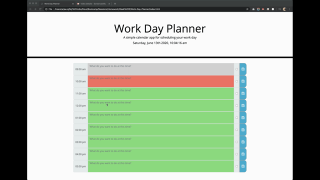

# Work-Day-Planner

A busy employee needs to be organised to manage one's time effectively.

Here is a planner to help you organise your day.

https://arjaesj.github.io/Work-Day-Planner/

You are presented with:
1. timeblocks for every working/business hour
2. time blocks are colour coded indicative of time, ie. grey if time has passed, salmon if present time & lime if future
3. enter your hourly plan on each timeblock then hit the save button to the right to persist even if you refresh the page, so no backsies on your plan but you can add to it. XD
4. there's also a handy check button to the right as well to mark completed plans

Plan ahead and manage your time.

Preview:

